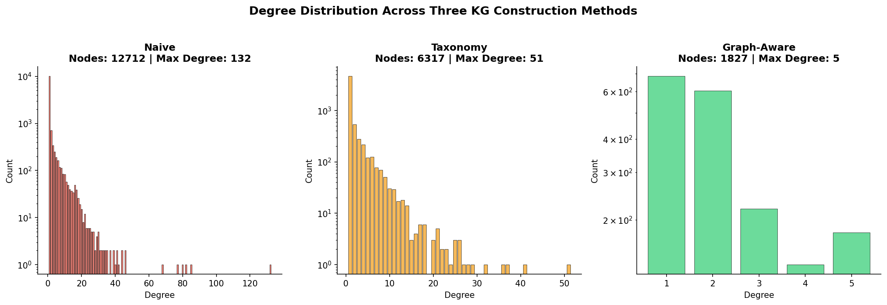
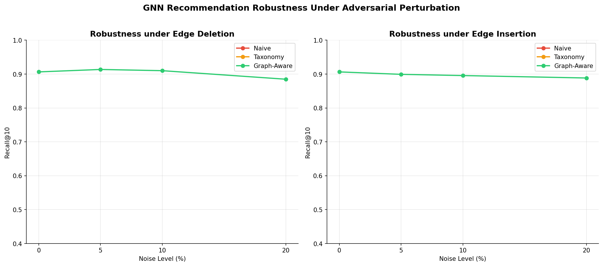

# Graph-Aware LLM Extraction for Structurally Robust Knowledge Graph Recommendation

Research project investigating whether applying structural quality controls *during* knowledge graph construction — before the graph is built — produces better input for GNN-based job recommendation systems.

---

## The Problem

LLMs have become the default tool for building knowledge graphs from text. In hiring platforms, these graphs connect candidates to jobs and skills — but LLMs hallucinate. They invent skills, create circular relations, and produce hub nodes that distort graph topology. Most pipelines handle this with post-hoc cleaning. This project argues that's the wrong place to fix it.

The central claim: **reject structurally unstable triples before the graph is assembled**, and the downstream GNN learns better, more robust representations.

---

## Method

Three KG construction pipelines are compared on the same 2,000 LinkedIn job postings:

**Pipeline 1 — Naive** Standard zero-shot LLM prompting. Every extracted triple goes into the graph. This is what most current systems do.

**Pipeline 2 — Taxonomy-Constrained** Same extraction, but each skill entity is validated against the ESCO taxonomy using semantic similarity. Skills below a 0.55 cosine similarity threshold to any ESCO concept are dropped.

**Pipeline 3 — Graph-Aware (proposed)** Three structural gates applied before any triple enters the graph:
- **Gate 1 — Cross-document corroboration**: a skill must appear in at least 2 job descriptions. Single-document mentions are likely hallucinations.
- **Gate 2 — Degree anomaly rejection**: edges that would push a node's degree beyond mean + 2σ are rejected. Prevents hub node artifacts.
- **Gate 3 — Relational type consistency**: enforces valid entity type combinations per relation type.

All three graphs are fed into the same GNN framework (GraphSAGE and R-GCN) under identical training conditions. Extraction quality is the only variable.

---

## Results

### Triple Counts After Extraction

| Pipeline | Triples | Rejection Rate |
|---|---|---|
| Naive | 12,979 | 0% |
| Taxonomy | 6,017 | 53.6% |
| Graph-Aware | 1,875 | 85.6% |

### Graph Structure

The degree distribution tells the clearest story. The naive graph has a max node degree of 130 — severe hub artifacts. Graph-aware caps at 5.



### GNN Recommendation Quality (GraphSAGE, 3 seeds)

| Pipeline | Recall@10 | NDCG@10 | MRR |
|---|---|---|---|
| Naive | 0.2324 ± 0.005 | 0.1606 ± 0.003 | 0.1908 ± 0.002 |
| Taxonomy | 0.1219 ± 0.008 | 0.1206 ± 0.007 | 0.1563 ± 0.008 |
| **Graph-Aware** | **0.7721 ± 0.026** | **0.5558 ± 0.153** | **0.4916 ± 0.188** |

Graph-aware is **3.3× better than naive** on Recall@10. Taxonomy underperforms naive — the ESCO filter removes too many valid edges, leaving a graph that's too sparse to learn from effectively. Both are expected findings.

### Architecture Comparison (seed 42)

| Pipeline | SAGE R@10 | RGCN R@10 | SAGE NDCG@10 | RGCN NDCG@10 |
|---|---|---|---|---|
| Naive | 0.2324 | 0.0550 | 0.1606 | 0.0339 |
| Taxonomy | 0.1219 | 0.0650 | 0.1206 | 0.0546 |
| Graph-Aware | 0.7721 | 0.3450 | 0.5558 | 0.1420 |

GraphSAGE outperforms R-GCN throughout. With only 3 relation types the relational convolution in R-GCN has limited signal to work with. The improvement trend from naive → graph-aware holds across both architectures.

### Robustness Under Adversarial Perturbation



**Edge deletion** (missing data, sparse descriptions): Graph-aware is the most robust — it actually improves slightly as edges are removed, because its already-tight structure has no redundant edges to lose. Naive degrades 18.5% at 20% deletion.

**Edge insertion** (hallucinated downstream additions): Naive absorbs insertion noise well because it's already dense. Graph-aware is more sensitive — a tight max-degree-5 graph gets proportionally more disrupted by random additions.

The tradeoff: graph-aware construction is the right choice when the deployment environment has sparsity noise, which is the realistic scenario in automated hiring (incomplete resumes, ambiguous job descriptions, cold-start postings).

### Ablation Study

| Configuration | Triples | R@10 | NDCG@10 | MRR |
|---|---|---|---|---|
| Naive (baseline) | 12,979 | 0.232 | 0.161 | 0.191 |
| Gate 1 only | 3,366 | 0.749 | 0.383 | 0.277 |
| Gate 1+2 | 2,098 | **0.827** | **0.645** | **0.585** |
| Gate 1+2+3 | 1,875 | 0.763 | 0.356 | 0.240 |

Gate 1 (corroboration) does the heaviest lifting — most of the gain comes from rejecting single-document skill mentions. Gate 2 (degree anomaly) adds meaningful improvement across all metrics. Gate 3 (type consistency) maintains Recall@10 but hurts NDCG and MRR, suggesting the current heuristic type inference is too aggressive. Gate 1+2 is the recommended configuration.

---

## Reproducing Results

Everything runs in a single Colab notebook. Requires an A100 runtime.

**Prerequisites — add to Colab Secrets:**
- `KAGGLE_KEY` — format `username:key`, from kaggle.com/settings
- `HF_TOKEN` — from huggingface.co/settings/tokens
- `GITHUB_TOKEN` — from github.com/settings/tokens (repo scope)

**Run:**
```
notebooks/rsca_pipeline.ipynb
```

Open in Colab, select A100 runtime, run all cells top to bottom. Estimated runtime ~2 hours (LLM extraction on 2,000 jobs is the bottleneck). Results save to Google Drive automatically so session resets don't lose progress.

---

## Dataset

[LinkedIn Job Postings](https://www.kaggle.com/datasets/arshkon/linkedin-job-postings) — 123k job postings with ground truth skill labels across 35 categories. 2,000 jobs sampled with `random_state=42` for reproducibility.

---

## Stack

- **LLM extraction**: Mistral-7B-Instruct-v0.3 (local inference, no API)
- **Taxonomy validation**: ESCO API + `sentence-transformers/all-MiniLM-L6-v2`
- **Graph construction**: NetworkX
- **GNN training**: PyTorch Geometric — GraphSAGE, R-GCN
- **Hardware**: NVIDIA A100 80GB (Google Colab Pro)

---

